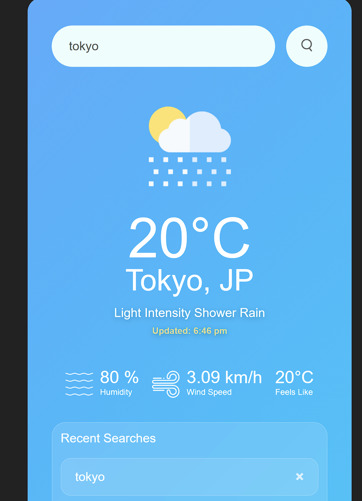

🌦️ Weather Dashboard

A modern, responsive Weather Dashboard built using HTML, CSS, and JavaScript, powered by the OpenWeather API.
It allows users to search any city and get real-time weather updates with a clean UI and recent search history feature.

🚀 Live Demo

👉 https://syedabsar99.github.io/weather-dashboard/

✨ Features
🔍 Search weather by city name
🌡️ Real-time temperature, humidity, wind speed
📍 Feels like temperature
🌦️ Dynamic weather icons (Clouds, Rain, Clear, etc.)
🕒 Auto-updated time display
🕘 Recent search history (stored in localStorage)
❌ Delete individual search history items
💾 Persistent data using localStorage
⚡ Responsive and modern UI design

🛠️ Tech Stack
HTML5
CSS3 (Flexbox + modern UI styling)
JavaScript (ES6)
OpenWeather API
📡 API Used
OpenWeather API
https://openweathermap.org/api
📸 Preview

## 📸 Preview

📂 Project Structure
weather-dashboard/
│
├── index.html
├── style.css
├── script.js
└── images/
🎯 What I Learned
Working with APIs in JavaScript
DOM manipulation
Async/Await & Fetch API
localStorage usage
UI/UX improvements for real projects

👨‍💻 Author :
 [@syedabsar99](https://github.com/syedabsar99)
