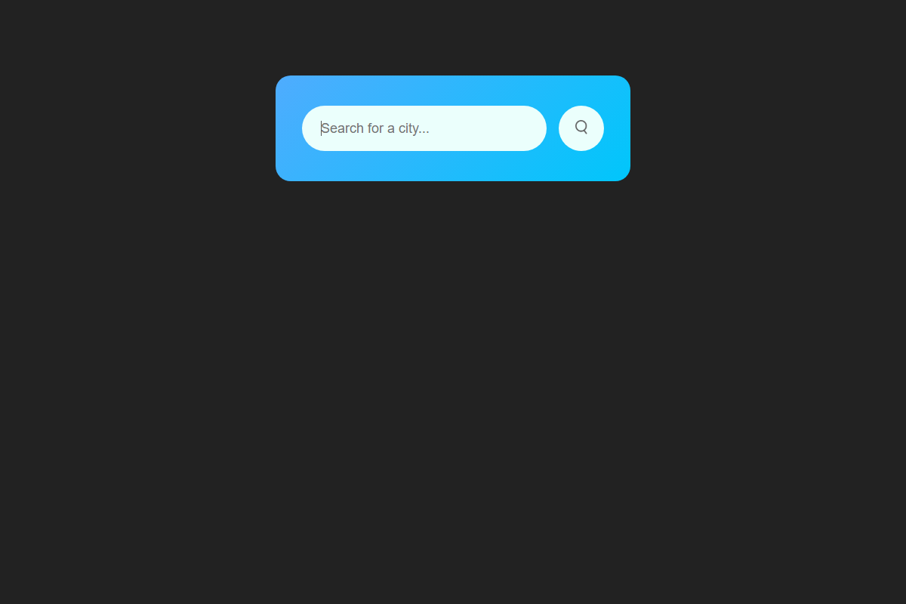

# SkyCast Weather Dashboard — Real-Time Global Meteorological Forecast App

A live meteorological dashboard web application built with pure Vanilla JavaScript, OpenWeatherMap API integration, semantic HTML5, and modern CSS3 delivering real-time city temperature, atmospheric humidity, wind velocity, and dynamic condition-based weather icons.

[](https://syedabsar99.github.io/weather-dashboard/)
[](script.js)
[](style.css)
[](LICENSE)

---

## Preview



> **Live Demo:** [syedabsar99.github.io/weather-dashboard](https://syedabsar99.github.io/weather-dashboard/)

---

## Overview

Designed and created by **Syed Noor Ul Absar**, SkyCast illustrates asynchronous API consumption and reactive DOM state rendering in standard Vanilla JavaScript without framework wrappers. By querying the OpenWeatherMap REST API, the application captures atmospheric telemetry for any city globally and displays clear, high-contrast meteorological metrics.

The visual theme dynamically changes its central weather illustration depending on conditions (Clear, Clouds, Rain, Drizzle, Mist, Snow).

---

## Key Features

- **Asynchronous REST API Integration** — Fetches live weather datasets utilizing standard `async/await` and browser `fetch` calls.
- **Condition-Aware Dynamic Graphics** — Automatically updates the primary weather artwork to match real-time weather conditions (Clear, Clouds, Rain, Drizzle, Mist).
- **Comprehensive Climate Metrics** — Displays temperature in Celsius, city designation, humidity percentage, and wind velocity (km/h).
- **Error & 404 Exception Handling** — Elegantly catches invalid city names or network issues, presenting user-friendly error banners without crashing the DOM.
- **Keyboard-Accessible Search** — Allows immediate submission via the 'Enter' key alongside the search button.
- **Responsive Neumorphic Card** — Perfectly centered mobile layout adapting cleanly on small screens (`<=480px`) without column collision.

---

## Tech Stack

| Layer | Technologies | Details |
| :--- | :--- | :--- |
| **Structure** | Semantic HTML5 | Search container, metrics layout, accessible image tags |
| **Styling** | Modern CSS3 | Linear gradients, Flexbox grid, subtle elevation shadows, media queries |
| **Logic** | Vanilla JavaScript (ES6+) | `fetch()`, `async/await`, JSON parsing, dynamic attribute switching |
| **API** | OpenWeatherMap API | Live weather data service |
| **Hosting** | GitHub Pages | Fast CDN deployment with HTTPS |

---

## Project Structure

```text
weather-dashboard/
├── images/            # Weather condition illustrations (clear, clouds, drizzle, rain, mist, humidity, wind)
├── index.html         # Application markup and weather dashboard card
├── LICENSE            # MIT open-source license
├── preview.png        # High-resolution application preview screenshot
├── README.md          # Comprehensive repository documentation
├── script.js          # REST API fetching, response parsing, and UI updates
└── style.css          # Design system, card layout, and responsive styles
```

---

## Getting Started

No build tools or bundlers are required.

### 1. Clone the repository
```bash
git clone https://github.com/syedabsar99/weather-dashboard.git
```

### 2. Open locally
Launch `index.html` in your browser:
```bash
cd weather-dashboard
start index.html
```

Or run via any static web server:
```bash
npx serve .
# or
python -m http.server 8080
```

---

## Author & Contact

**Syed Noor Ul Absar**
- **Role**: Frontend Web Developer
- **Education**: Bachelor of Computer Applications (BCA), Chandigarh University (8.35 SGPA)
- **Portfolio**: [syedabsar99.github.io/portfolio](https://syedabsar99.github.io/portfolio/)
- **GitHub**: [@syedabsar99](https://github.com/syedabsar99)
- **LinkedIn**: [linkedin.com/in/syed-noor-ul-absar-7b6408365](https://www.linkedin.com/in/syed-noor-ul-absar-7b6408365/)
- **Email**: syedabsar99@gmail.com

---

## License

This project is licensed under the [MIT License](LICENSE) — feel free to use, modify, and distribute for educational or personal use.
